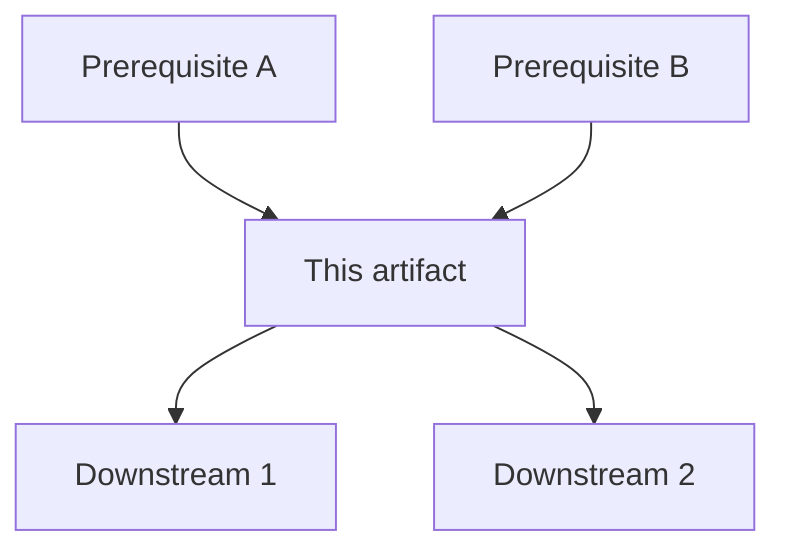

# Handoff Checklist Template

**Owner:** _name_  
**Artifact:** _module / page / demo sandbox / content pack_  
**Audience:** _AE / next coordinator / partner staff_  
**Last verified:** _YYYY-MM-DD_

> Transfer quality rule (senior year 2026–27): if someone has to guess, the handoff is not clean yet.

Use this schema for Canvas publishes, ServeIT-style partner handoffs, and demo sandboxes. Fill every section before you mark the ship live.

---

## 1. Automated status check

What "green" means for this ship. Not vibes. Checks.

| Check | How it runs | Pass looks like | Owner |
| --- | --- | --- | --- |
| Link / route smoke | CI, checklist script, or manual deep-link pass | Every CTA and internal jump resolves | |
| Content completeness | Publish checklist / lint / visual scan | No `TODO`, stub copy, or broken media | |
| Accessibility gate | Keyboard + screen-reader spot check; `lang` where mixed | WCAG 2.1 AA intent for the scoped surface | |
| Seed / reset (if demo) | Reseed script or documented reset path | Second run starts from known state | |
| Permissions | Role matrix | Audience can do the job without staff secrets | |

**CI / checklist meaning (content/ops ships):**

- A green automated check means the *machine* path is intact (links, build, schema).
- A green human checklist means the *instruction* path is intact (owner, done-state, next step).
- Both are required for transfer-quality. Automation without a human done-state is half a sandwich.

---

## 2. Dependency graph

List upstream → this artifact → downstream. Prefer a short tree; mermaid optional.

```text
[upstream]
  ├─ prerequisite A (owner, status)
  ├─ prerequisite B (owner, status)
  └─ this artifact
        ├─ downstream consumer 1
        └─ downstream consumer 2
```



**Notes:**

- Name owners on each node.
- Strike orphaned modules. If nobody owns a prerequisite, stop the publish.

---

## 3. Blast radius statement

If this ship fails or goes stale, what breaks?

| Downstream | Failure mode | Severity | Mitigation |
| --- | --- | --- | --- |
| _e.g. mentor Day 3 quiz_ | Missing prerequisite → mentors skip module | High | Hold publish; notify coordinator |
| _e.g. AE demo path_ | Stale seed → empty happy path | High | Reseed + one-pager |
| _e.g. partner edit path_ | Wrong chunk map → staff cannot update | Med | Point to Rivet/Cascade notes |

**One-sentence blast radius:**  
_If this fails, …_

---

## Sign-off

- [ ] Status checks green (automated + human)
- [ ] Dependency graph reviewed
- [ ] Blast radius acknowledged by owner
- [ ] Next person can re-run cold without paging me

**Signed:** _name_ · _date_
